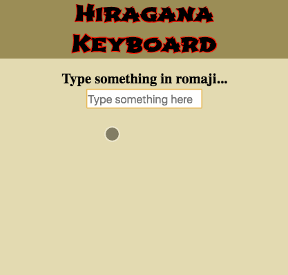

# Hiragana

A React-based application to convert letters into hiragana

## Live Demo
There is currently no live demo of hiragana

## Technologies Used
- React.js
- HTML5
- CSS 3
- npm
- Webpack
- Babel

## Features
- User can type in romaji words
- User can see hiragana of the words they typed

## Preview


## Development
#### System Requirements
- npm 6 or higher
- LiveServer or equivalent

All other requirements are already included with the application

#### Getting Started
1. Clone the repository

```
git clone https://github.com/a-canlas/hiragana.git
```

2. Navigate to folder where clone is located

```
cd hiragana
```

3. Install dependencies with NPM

```
npm install
```

4. Open index.html with LiveServer
